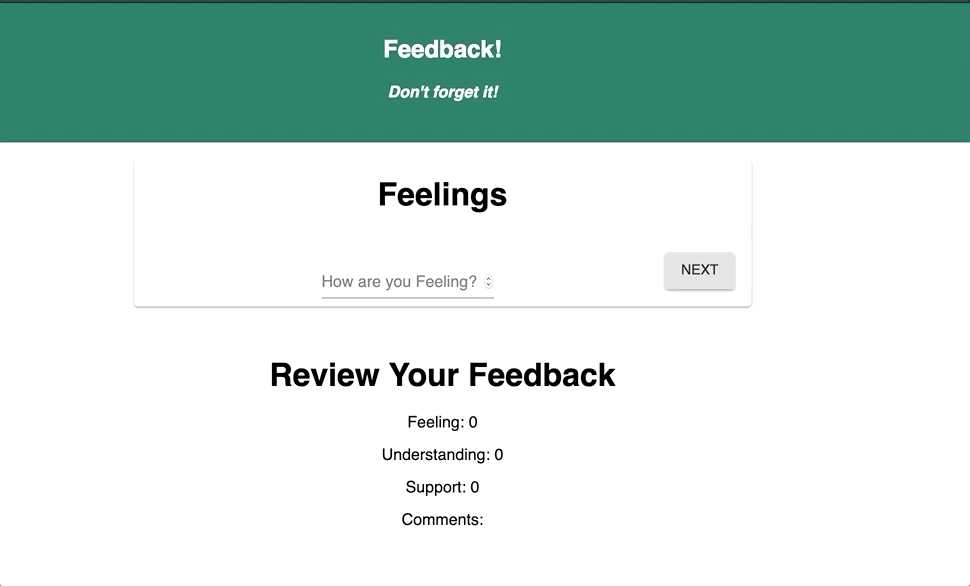

#Redux Feedback Form
This is an application that lets you enter your feedback daily. It saves it and shows you a review of the feedback immediately.
The feedback is not submitted if the form is not filled properly.

### SETUP

download this repo.
npm install
npm run server
npm run client

### DESCRIPTION

This is a multi-part form that allows users to leave daily feedback. There are 4 feedback forms to fill:

- Feelings:         How are you Feeling Today?
- Understanding:    Do You Understand te content?
- Support:          Do You feel supported?
- Comments:         Any Comments?

At each step of the feedback form, the app displays an immediate response for the user to see what was input to the form.

### REVIEW
The app displays the results of each feedback (4 in total. But we can make it as many as needed) coalated together at the end. The user gets to review all the results before submitting the form.

### SUBMIT FEEDBACK.
This is where the applicatin checks to make sure the form was propery filled. If it is properly filled, the Submit is activated. If not filled properly, the button is inactive.

## TECHNOLOGY USED
## Technolgies used:
React
Redux
JavaScript
axios
PostgresSQL
Material UI
CSS

